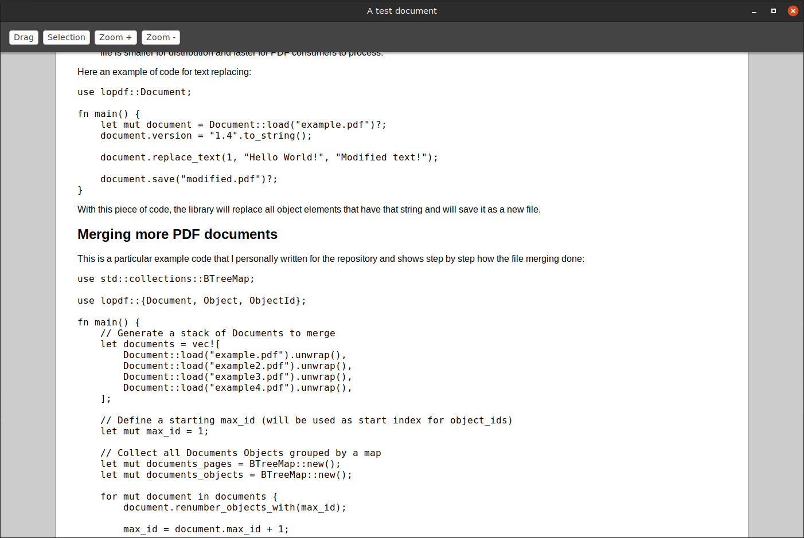

# Compact Web Document documentation

This repository will hold all documentation resources and help & tricks in order to get all setup and ready to use.

## The structure of the project

The CWD repositories are distributed as follows:

- `cwd-reader` - Cross platform GUI reader for the CWD format
- `cwd-lib` - Core of CWD that includes all manipulation of the document API
- `cwd-integrations` - Some example of integration of the CWD lib
- `cwd-editor` - Document editor and creator for the CWD format
- `cwd-app` - Cross platform mobile application
- `cwd-assets` - Assets, resources, graphics and more
- `cwd-site-frontend` - Frontend for the CWD public site
- `cwd-site-backend` - Web Services for the CWD public site
- `cwd-test` - Automated testing suite for all the libraries and CWD repositories

## CWD file structure

You can create a ZIP file and rename it as ".cwd", the archive should include these base files:

- `cwd.html` that is the main content of the CWD file, the HTML shouldn't contain any HTML tag
    - The file should be structured like:
    ```html
    <div class="page" size="A4" layout="portrait">
        <h1>Sample title</h1>
        <p>Sample text.</p>
    </div>
    ```
- `cwd.toml` that contains some document meta-information:
    - The file should be structured like:
    ```toml
    version = "1.0"
    title = "A test document"
    ```
- `resources/cwd.css` that is the main document stylesheet with any custom rule
- You can embed many resources as needed, just put files inside the `resources` directory and use in the `cwd.html` or `cwd.css` with the `cwd://resources/file.ext` way.

## Building

If you want a minimal environment where you can play with the CWD format, act as follows:

- Create a `cwd` folder where you'll put all project repositories
- Enter on the `cwd` folder
- Clone this repository
- Clone the [cwd-lib](https://github.com/compact-web-document/cwd-lib) repository
- Clone the [cwd-reader](https://github.com/compact-web-document/cwd-reader) repository
- Download the appropriate CEF distribution, you can pick-up one via Spotify [here](http://opensource.spotify.com/cefbuilds/index.html)

These are the minimal needed projects for let CWD running.

### Linux (Ubuntu)

Currently supported distributions include Debian Wheezy, Ubuntu Precise, and related. Ubuntu 18.04 64-bit is recommended. Newer versions will likely also work but may not have been tested.

Required packages include:

- `build-essential`
- `libgtk2.0-dev` (required by the cefclient target only)
- `libgtkglext1-dev` (required by the cefclient target only)

Install the needed Rust binaries and tools:

- `curl --proto '=https' --tlsv1.2 -sSf https://sh.rustup.rs | sh`

### MacOS

Xcode 8 or newer building on MacOS 10.10 (Yosemite) or newer. Xcode 11.2 and MacOS 10.14 are recommended. The Xcode command-line tools must also be installed. Only 64-bit builds are supported.

Install the needed Rust binaries and tools:

- `curl --proto '=https' --tlsv1.2 -sSf https://sh.rustup.rs | sh`

### Windows (TODO)

Visual Studio 2015 or newer building on Windows 7 or newer. Visual Studio 2019 and Windows 10 64-bit are recommended.

Install the needed Rust binaries and tools:

- Download Rust [here](https://win.rustup.rs/x86_64)

## Running

First of all, you need to build the `cwd-lib` library, you can do it with `cargo +stable build` inside the `cwd-lib` folder. Once you do that, the library will be available for the Reader embedding.

Second, you have to export the `CWD_LIB_PATH` environment variable with the absolute path of the `target` dir lib (eg. "/home/user/cwd/cwd-lib/target") and another `CEF_SRCS` variable with the downloaded CEF distribution path (eg. "/home/user/Downloads/cef")

Three, you have to build the `cwd-reader` in order to play with the CWD file, please install [CLion EAP](https://www.jetbrains.com/clion/nextversion/) and then open the `cwd-reader` project and simply run it.

If everything is setup correctly, you will see something like:


